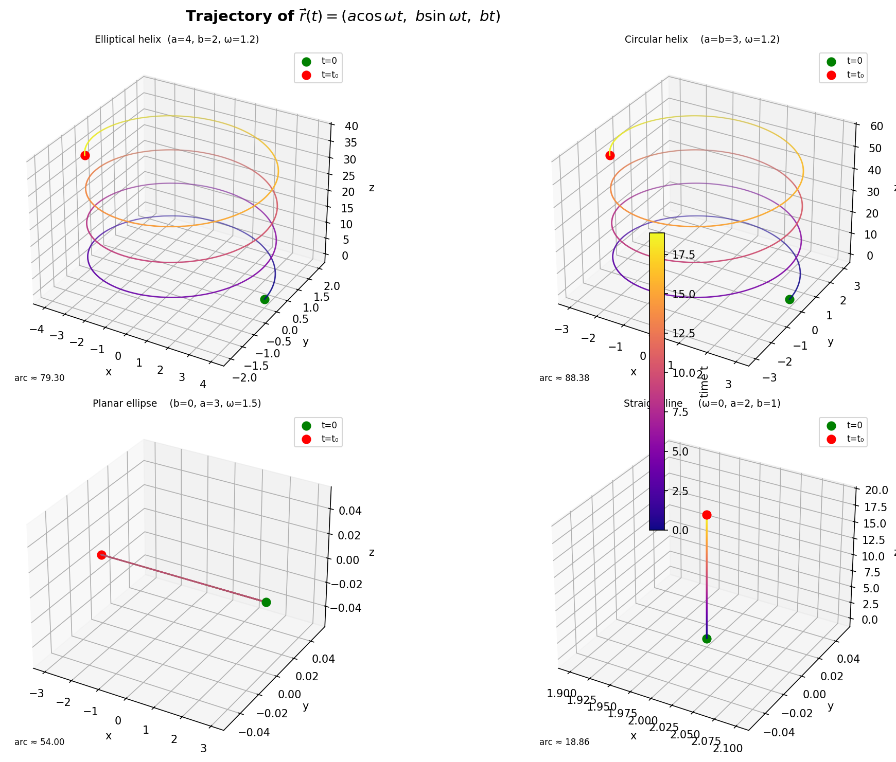

# Section 1: Mechanics I — Solutions

---

## 1. Projectile Motion

Given:

$$
v_0 = 100\ \text{m/s}, \qquad \theta = 37^\circ, \qquad g = 9.81\ \text{m/s}^2
$$

Resolve the initial velocity into components:

$$
v_{0x} = v_0 \cos\theta, \qquad v_{0y} = v_0 \sin\theta
$$

### Differential equations of motion

In the horizontal direction there is no acceleration:

$$
\frac{d^2x}{dt^2} = 0
$$

In the vertical direction gravity acts downward:

$$
\frac{d^2y}{dt^2} = -g
$$

With initial conditions

$$
x(0)=0, \quad y(0)=0, \quad \frac{dx}{dt}(0)=v_0\cos\theta, \quad \frac{dy}{dt}(0)=v_0\sin\theta
$$

Integrating gives:

$$
x(t) = v_0 \cos\theta\, t
$$

$$
y(t) = v_0 \sin\theta\, t - \frac{1}{2}gt^2
$$

### Time of flight

The projectile lands when $y(T)=0$ with $T>0$:

$$
v_0\sin\theta\,T - \frac{1}{2}gT^2 = 0
$$

$$
T\left(v_0\sin\theta - \frac{gT}{2}\right)=0
$$

Hence,

$$
T = \frac{2v_0\sin\theta}{g}
$$

Numerically,

$$
T = \frac{2(100)\sin 37^\circ}{9.81} \approx 12.27\ \text{s}
$$

### Maximum height

At the top of the trajectory, the vertical velocity is zero:

$$
v_y(t) = v_0\sin\theta - gt
$$

So the time to reach maximum height is

$$
t_{\max} = \frac{v_0\sin\theta}{g}
$$

Substitute into $y(t)$:

$$
H_{\max} = \frac{v_0^2\sin^2\theta}{2g}
$$

Numerically,

$$
H_{\max} = \frac{100^2\sin^2 37^\circ}{2(9.81)} \approx 184.6\ \text{m}
$$

### Range

The horizontal range is

$$
R = x(T) = v_0\cos\theta \cdot T
$$

$$
R = v_0\cos\theta \cdot \frac{2v_0\sin\theta}{g}
= \frac{v_0^2\sin(2\theta)}{g}
$$

Numerically,

$$
R = \frac{100^2\sin 74^\circ}{9.81} \approx 979.9\ \text{m}
$$

---

## 2. Range Optimization

For projectile motion,

$$
R(\theta) = \frac{v_0^2\sin(2\theta)}{g}
$$

Since $v_0^2/g$ is constant, maximizing $R(\theta)$ is equivalent to maximizing $\sin(2\theta)$.

Differentiate:

$$
\frac{dR}{d\theta} = \frac{v_0^2}{g} \cdot 2\cos(2\theta)
$$

Set the derivative to zero:

$$
\cos(2\theta)=0
$$

$$
2\theta = \frac{\pi}{2} \quad \Rightarrow \quad \theta = \frac{\pi}{4} = 45^\circ
$$

Also, $\sin(2\theta)$ reaches its maximum possible value, $1$, when $2\theta=\pi/2$.

Therefore the maximum range is achieved at

$$
\boxed{\theta = 45^\circ}
$$

and the maximum range itself is

$$
R_{\max} = \frac{v_0^2}{g}
$$

---

## 3. Path Intersection

Alice:

$$
A(t) = (2+t,\ 8-3t)
$$

Bob:

$$
B(t) = (2t-1,\ 2t+2)
$$

### Do they collide at the same time?

For a collision we need $A(t)=B(t)$ for the same $t$.

From the $x$-coordinates:

$$
2+t = 2t-1 \quad \Rightarrow \quad t=3
$$

Check the $y$-coordinates at $t=3$:

$$
8-3(3) = -1, \qquad 2(3)+2=8
$$

These are not equal, so they do not collide.

### Do the geometric paths intersect?

Allow different parameters $s$ and $u$:

$$
(2+s,\ 8-3s) = (2u-1,\ 2u+2)
$$

From the first equation,

$$
u = \frac{s+3}{2}
$$

Substitute into the second:

$$
8-3s = 2\left(\frac{s+3}{2}\right)+2 = s+5
$$

$$
3 = 4s \quad \Rightarrow \quad s = \frac{3}{4}
$$

Then

$$
u = \frac{\frac{3}{4}+3}{2} = \frac{15}{8}
$$

The paths intersect at the point

$$
\left(2+\frac{3}{4},\ 8-3\cdot\frac{3}{4}\right)=\left(\frac{11}{4},\ \frac{23}{4}\right)
$$

So the paths intersect geometrically, but the two people are not there at the same time.

### Minimum distance between them

At equal time $t$, the separation vector is

$$
A(t)-B(t) = \bigl((2+t)-(2t-1),\ (8-3t)-(2t+2)\bigr) = (3-t,\ 6-5t)
$$

Hence

$$
D^2(t) = (3-t)^2 + (6-5t)^2
$$

$$
D^2(t) = 26t^2 - 66t + 45
$$

Minimize this quadratic:

$$
\frac{d}{dt}D^2(t) = 52t - 66 = 0
$$

$$
t = \frac{33}{26} \approx 1.269\ \text{s}
$$

The minimum squared distance is

$$
D^2_{\min} = 26\left(\frac{33}{26}\right)^2 - 66\left(\frac{33}{26}\right) + 45 = \frac{81}{26}
$$

Therefore,

$$
D_{\min} = \frac{9}{\sqrt{26}} \approx 1.77
$$

Conclusion:

$$
\boxed{\text{No collision occurs. The minimum distance is } \frac{9}{\sqrt{26}} \text{ at } t=\frac{33}{26}.}
$$

---

## 4. Vector Calculus

Given

$$
\vec r(t) = (3t^2)\hat i + (5t-8t^2)\hat j
$$

Velocity is the derivative of position:

$$
\vec v(t) = \frac{d\vec r}{dt} = (6t)\hat i + (5-16t)\hat j
$$

Acceleration is the derivative of velocity:

$$
\vec a(t) = \frac{d\vec v}{dt} = 6\hat i - 16\hat j
$$

So,

$$
\boxed{\vec v(t) = 6t\hat i + (5-16t)\hat j}
$$

$$
\boxed{\vec a(t) = 6\hat i - 16\hat j}
$$

---

## 5. Relative Velocity

River velocity relative to the ground:

$$
\vec v_r = 2\hat i
$$

Let the boat head at an angle $\alpha$ west of north. Its velocity relative to the water is

$$
\vec v_{bw} = -5\sin\alpha\,\hat i + 5\cos\alpha\,\hat j
$$

The boat wants to move directly north relative to the ground, so the total east-west component must be zero:

$$
-5\sin\alpha + 2 = 0
$$

$$
\sin\alpha = \frac{2}{5}
$$

$$
\alpha = \sin^{-1}\left(\frac{2}{5}\right) \approx 23.6^\circ
$$

So the boat should head

$$
\boxed{23.6^\circ \text{ west of north}}
$$

The northward speed across the river is then

$$
v_{\text{north}} = 5\cos\alpha = 5\sqrt{1-\left(\frac{2}{5}\right)^2} = \sqrt{21} \approx 4.58\ \text{m/s}
$$

If the river is 200 m wide, the crossing time is

$$
t = \frac{200}{\sqrt{21}} \approx 43.6\ \text{s}
$$

---

## 6. Variable Velocity

Given

$$
v(t)=t^2+2t-5
$$

Acceleration is

$$
a(t)=\frac{dv}{dt}=2t+2
$$

Position is the integral of velocity:

$$
x(t)=\int (t^2+2t-5)\,dt = \frac{t^3}{3}+t^2-5t+C
$$

Use $x(0)=4$:

$$
4=C
$$

So

$$
x(t)=\frac{t^3}{3}+t^2-5t+4
$$

At $t=3$,

$$
x(3)=\frac{27}{3}+9-15+4=7
$$

$$
a(3)=2(3)+2=8
$$

Therefore,

$$
\boxed{x(3)=7}
$$

$$
\boxed{a(3)=8}
$$

---

## 7. Elimination of Time and Interpretation of Acceleration

Given

$$
x(t)=2t^2, \qquad y(t)=3t^3
$$

### Eliminate the parameter

From $x=2t^2$,

$$
t^2 = \frac{x}{2}
$$

Square $y=3t^3$ to avoid the sign ambiguity:

$$
y^2 = 9t^6 = 9\left(\frac{x}{2}\right)^3 = \frac{9}{8}x^3
$$

So the Cartesian equation is

$$
\boxed{y^2 = \frac{9}{8}x^3, \qquad x \ge 0}
$$

This is a semicubical parabola. For $t>0$, the curve lies above the $x$-axis; for $t<0$, it lies below it.

### Trajectory sketch

The trajectory starts at the origin and opens to the right, with two branches symmetric about the $x$-axis.

### Velocity and speed

$$
\vec v(t) = \left(\frac{dx}{dt},\frac{dy}{dt}\right) = (4t,\ 9t^2)
$$

$$
|\vec v(t)| = \sqrt{(4t)^2 + (9t^2)^2} = \sqrt{16t^2 + 81t^4} = |t|\sqrt{16+81t^2}
$$

### Acceleration and its magnitude

$$
\vec a(t) = \left(\frac{d^2x}{dt^2},\frac{d^2y}{dt^2}\right) = (4,\ 18t)
$$

$$
|\vec a(t)| = \sqrt{4^2 + (18t)^2} = \sqrt{16+324t^2}
$$

### Is the acceleration constant?

No. The $x$-component is constant, but the $y$-component is $18t$, which depends on time. Therefore,

$$
\boxed{\vec a(t) \text{ is not constant}}
$$

---

## 8. Circular Motion

At the equator, the centripetal acceleration due to Earth's rotation is

$$
a_c = \omega^2 R = \frac{4\pi^2 R}{T^2}
$$

Take

$$
R = 6378\ \text{km} = 6.378\times 10^6\ \text{m}, \qquad T = 24\times 3600 = 86400\ \text{s}
$$

Then

$$
a_c = \frac{4\pi^2(6.378\times 10^6)}{86400^2} \approx 3.37\times 10^{-2}\ \text{m/s}^2
$$

So,

$$
\boxed{a_c \approx 0.0337\ \text{m/s}^2}
$$

This is about $0.34\%$ of $g$.

---

## 9. Momentum Comparison

Momentum is

$$
p=mv
$$

### Fly

$$
m_f = 2\ \text{g} = 0.002\ \text{kg}, \qquad v_f = 10\ \text{m/s}
$$

$$
p_f = 0.002 \cdot 10 = 0.020\ \text{kg m/s}
$$

### Tennis ball

$$
m_t = 60\ \text{g} = 0.060\ \text{kg}, \qquad v_t = 1\ \text{m/s}
$$

$$
p_t = 0.060 \cdot 1 = 0.060\ \text{kg m/s}
$$

Since

$$
0.060 > 0.020
$$

the tennis ball has the greater momentum.

$$
\boxed{\text{The tennis ball has 3 times the momentum of the fly.}}
$$

---

## 10. Kinematics

Given

$$
\vec r(t) = \bigl(a\cos(\omega t),\ b\sin(\omega t),\ bt\bigr)
$$

### a) Equation of the trajectory

From the first two coordinates,

$$
x = a\cos(\omega t), \qquad y = b\sin(\omega t)
$$

Hence,

$$
\frac{x^2}{a^2} + \frac{y^2}{b^2} = \cos^2(\omega t) + \sin^2(\omega t) = 1
$$

The projection onto the $xy$-plane is therefore an ellipse.

Because

$$
z=bt
$$

the point rises linearly in $z$, so the full 3D trajectory is an elliptical helix:

$$
\boxed{\frac{x^2}{a^2} + \frac{y^2}{b^2} = 1, \qquad z=bt}
$$

Equivalently, eliminating $t$ in favor of $z$ gives

$$
x = a\cos\left(\frac{\omega z}{b}\right), \qquad y = b\sin\left(\frac{\omega z}{b}\right)
$$

### b) Path length from $t=0$ to $t=t_0$

Differentiate:

$$
\vec v(t) = \frac{d\vec r}{dt} = \bigl(-a\omega\sin(\omega t),\ b\omega\cos(\omega t),\ b\bigr)
$$

Its magnitude is

$$
|\vec v(t)| = \sqrt{a^2\omega^2\sin^2(\omega t) + b^2\omega^2\cos^2(\omega t) + b^2}
$$

Therefore the arc length is

$$
\boxed{s(t_0)=\int_0^{t_0} \sqrt{a^2\omega^2\sin^2(\omega t) + b^2\omega^2\cos^2(\omega t) + b^2}\,dt}
$$

In general this integral is expressed in terms of elliptic integrals.

Special case $a=b=R$:

$$
|\vec v(t)| = \sqrt{R^2\omega^2 + b^2}
$$

which is constant, so

$$
s(t_0)=t_0\sqrt{R^2\omega^2+b^2}
$$

### c) Python visualization and special cases

Example Python code:

```python
import numpy as np
import matplotlib.pyplot as plt

a = 4
b = 2
omega = 1.2
t0 = 8 * np.pi

t = np.linspace(0, t0, 1200)
x = a * np.cos(omega * t)
y = b * np.sin(omega * t)
z = b * t

fig = plt.figure(figsize=(8, 6))
ax = fig.add_subplot(111, projection="3d")
ax.plot(x, y, z, linewidth=2)

ax.set_xlabel("x")
ax.set_ylabel("y")
ax.set_zlabel("z")
ax.set_title("Elliptical Helix")
plt.show()
```

Special cases:

- If $a=b$, the projection in the $xy$-plane is a circle, so the trajectory becomes a circular helix.
- If $\omega=0$, then $x=a$, $y=0$, and the motion is a straight vertical line.
- If $b=0$, then $y=0$ and $z=0$, so the motion collapses to oscillation along the $x$-axis.
